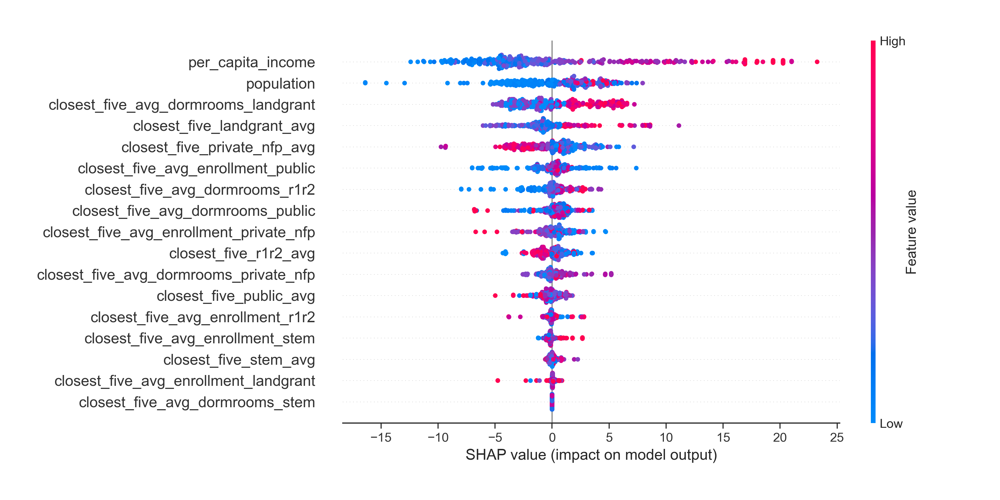

# State of Georgia Analysis

This folder includes the results and working files for the analysis of AP outcome results from the state of Georgia. Pickled data files are found under 'AP-Outcomes-to-University-Metrics/data/GA_pickled/'

## File descriptions

### GA_working.ipynb

This file pulled and processed the Georgia results to include university metrics results; remove empty, incomplete, and non-single county districts\*; and save resulting workable data. Outcomes are pulled from the GA department of Education.

\* Fulton county and Atlanta Public Schools were manually combined due to author's knowledge of the Atlanta Metro Area. No other manual corrections of school districts were utilized. This district was manually corrected due to the bulk of Fulton county overlapping with Atlanta.

### GA_modelling.ipynb

This file was used to calculate the Georgia models and calculate initial fit metrics.

### GA_summation-visualization.ipynb

This file was used to produce summary statistics and visualizations of the key Georgia results.

## Methodological Descriptions and Results

### Features and targets

#### Target: AP Pass Rate

AP Pass Rate is the percent of exams where a 3 or higher has been scored. This does not descriminate if 1 student took 4 exams or if 4 students took 1 exam. i.e., it is not a metric of exam accessibility. To increase dataset 5 years (2018-2022 starting school years) were combined. This results in a little over 500 outcomes.

#### Features

The first 2 features are general data.

The subsequent features are university metrics using a nearest 5 method via `geopy` `distance`. The county location is obtained from [simplemaps](https://simplemaps.com/data/us-counties); the corresponding dataset is saved as 'AP-Outcomes-to-University-Metrics/data/uscounties.csv'. The locations for the universities are mostly acquired via Google geocoders.

1. Population: constant for all 5 years.
2. Per captia income: year over year income.
3. Nearest 5 average distance of R1/R2 research institutes.
4. Nearest 5 average distance of public institutes.
5. Nearest 5 average distance of non-profit (nfp) private institutes.
6. Nearest 5 average distance of landgrant institutes.
7. Nearest 5 average distance of STEM institutes.
8. Annual enrollment nearest 5 average of R1/R2 research institutes.
9. Annual enrollment nearest 5 average of public institutes.
10. Annual enrollment nearest 5 average of nfp private institutes.
11. Annual enrollment nearest 5 average of landgrant institutes.
12. Annual enrollment nearest 5 average of STEM institutes.
13. Number of dorm beds nearest 5 of R1/R2 research institutes.
14. Number of dorm beds nearest 5 of public institutes.
15. Number of dorm beds nearest 5 of nfp private institutes.
16. Number of dorm beds nearest 5 of landgrant institutes.
17. Number of dorm beds nearest 5 of STEM institutes.

Only income and outcome vary across years as university metrics are not computed annually in our dataset. Additional state-based and university-based information was discarded in this study (ex. participation or minority-serving categorizations).

### Baseline statistics

|Feature                               |       mean         |       stdev          |
|:-------------------------------------|-------------------:|---------------------:|
| AP Pass Rate                         | 45.73%             | 19.63%               |
| Population                           | 91603.7 people     | 170317 people        |
| Per Capita Income                    | $43263.5           | $10288.0             |
| Closest 5 r1r2 avg distance          | 111.504 km         | 44.7489 km           |
| Closest 5 public avg distance        | 46.2149 km         | 13.7613 km           |
| Closest 5 private nfp avg distance   | 73.4    km         | 35.9156 km           |
| Closest 5 landgrant avg distance     | 175.727 km         | 32.6533 km           |
| Closest 5 stem avg                   | 121.907 km         | 52.2528 km           |
| Closest 5 avg enrollment r1r2        | 27975.4 students   | 3901.18 students     |
| Closest 5 avg enrollment public      | 11248.2 students   | 5832.08 students     |
| Closest 5 avg enrollment private nfp | 2411.01 students   | 1170.35 students     |
| Closest 5 avg enrollment landgrant   | 22493.9 students   | 2699.51 students     |
| Closest 5 avg enrollment stem        | 27184.9 students   | 4191.07 students     |
| Closest 5 avg dormrooms r1r2         | 5402.14 dorm beds  | 792.995  dorm beds   |
| Closest 5 avg dormrooms public       | 1339.2  dorm beds  | 843.2    dorm beds   |
| Closest 5 avg dormrooms private nfp  | 857.802 dorm beds  | 437.302  dorm beds   |
| Closest 5 avg dormrooms landgrant    | 5189.24 dorm beds  | 771.094  dorm beds   |
| Closest 5 avg dormrooms stem         | 5470.65 dorm beds  | 912.501  dorm beds   |

### Models

#### Initial statistical analysis

p-values of the following models between eachother using `statsmodels`:

1. Full 17 feature model
2. Population-income model (non-university)
3. University-only model (no population-income)

All p-values are on the order of $10^{-5}$ or smaller.

#### Fitting predictive models

1. Baseline
2. Full 17 feature model with OLS Linear Regression `sklearn`
3. Non-university model with OLS Linear Regression `sklearn`
4. University-only model with OLS Linear Regression `sklearn`
5. No dormroom consideration feature model with OLS Linear Regression `sklearn`
6. Full 17 feature model with Ridge Regression `sklearn`
7. 9 transformed feature model with PCA `sklearn`
8. Full 17 feature model with xgboost `xgboost`
9. Adaboost model
10. Random Forest model

The following table comes from 5-fold cross validation.

|Model             |RMSE   |STDEV   |R2 Score |
|------------------|-------|--------|---------|
|Baseline          | 20.05 | 0.9866 | -0.0372 |
|Full Linear       | 16.57 | 1.399  | 0.2827  |
|Non-university    | 18.23 | 1.204  | **      |
|University-only   | 17.78 | 1.337  | **      |
|No dormroom       | 17.06 | 1.249  | **      |
|Full Ridge        | 16.56 | 1.391  | 0.2841  |
|PCA Transformation| 17.09 | 1.252  | 0.2385  |
|xgboost           | 12.05 | 1.269  | 0.6086  |
|Adaboost          | 12.90 | 1.168  | 0.5615  |
|Random Forest     | 13.52 | 1.153  | 0.5209  |

**As XGBoost performed generally optimal, we computed RMSE and R2 against the test data reserved for scores of 10.27 and 0.6755 respectively.**

#### SHAPLY calculations

To better visualize the role of the 17 features we performed some simple SHAP calculations. Georgia is notable for having a less severe dependence on population and income. Further investigations would be useful. We also calculated the values of the ranked feature importance.

Feature Importance from SHAP:

|                                Feature|  Importance|
|---|---|
|                      per_capita_income|    5.920026|
|                             population|    2.900259|
|   closest_five_avg_dormrooms_landgrant|    2.632638|
|             closest_five_landgrant_avg|    1.897238|
|           closest_five_private_nfp_avg|    1.854983|
|     closest_five_avg_enrollment_public|    1.238844|
|        closest_five_avg_dormrooms_r1r2|    1.051907|
|      closest_five_avg_dormrooms_public|    1.037098|
|closest_five_avg_enrollment_private_nfp|    0.928828|
|                  closest_five_r1r2_avg|    0.895733|
| closest_five_avg_dormrooms_private_nfp|    0.697346|
|                closest_five_public_avg|    0.575374|
|       closest_five_avg_enrollment_r1r2|    0.342270|
|       closest_five_avg_enrollment_stem|    0.299934|
|                  closest_five_stem_avg|    0.205257|
|  closest_five_avg_enrollment_landgrant|    0.180089|
|        closest_five_avg_dormrooms_stem|    0.000000|

### Visualizations

We visualized the relationships to pass rate using seaborn's regplot. Noteably the closest 5 distances nearly all had a negative impact except landgrant universities. The population extremes are an issue thus population on the log scale is presented. This comes with the expense of linear visualization. Due to the jagged feature size cohesive visualization was a challenge.

<!--  -->

## Conclusion

Georgia proves interesting in it's modestly reduced dependence on income; however, it generally trends like the other states. It's largest university influence was landgrant university dorms and distance both with slight positive relationships. Shockingly nearby universities of other types do not have a positive relationship. Landgrant universities had the highest average distance away. One has to ask if perhaps the distance is so far that it may actually be an erroneous conclusion. We selected XGBoost as the optimal model for Georgia. Overall, Georgia provides evidence to the variance of states across the US. Further research would be advantaged by minority considerations at least at the university level, the use of more years, and the absorbtion of other city districts into their appropriate counties.
